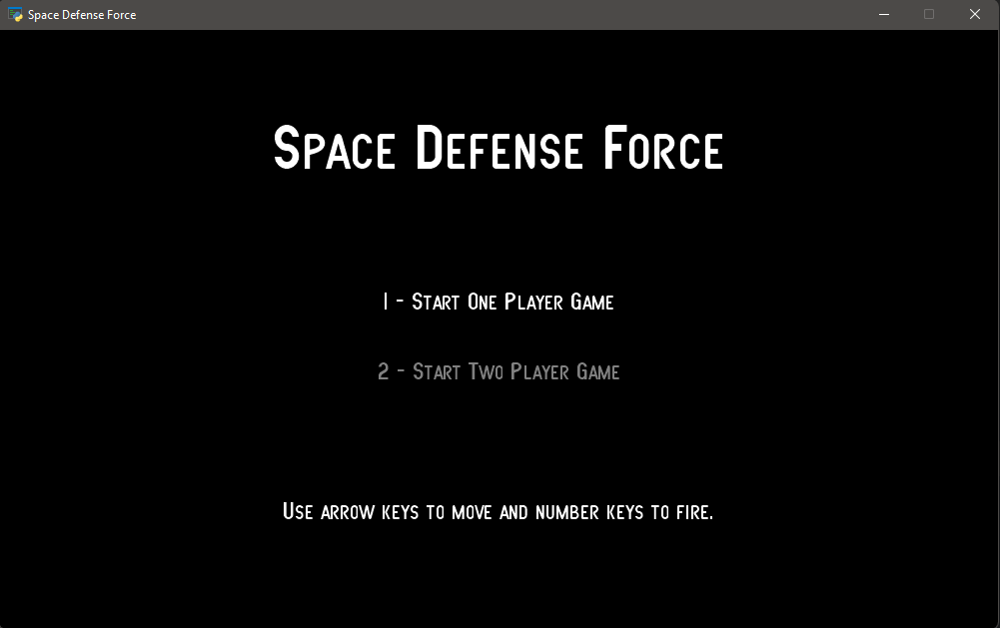
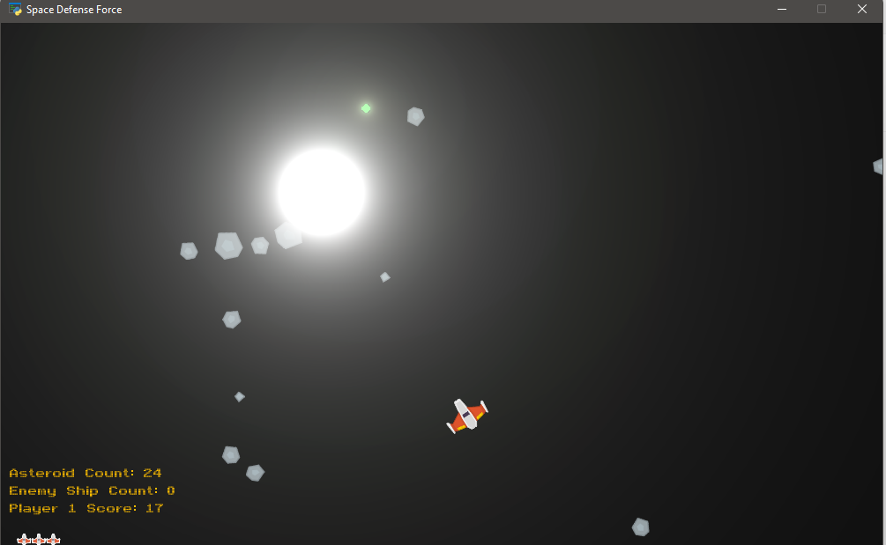
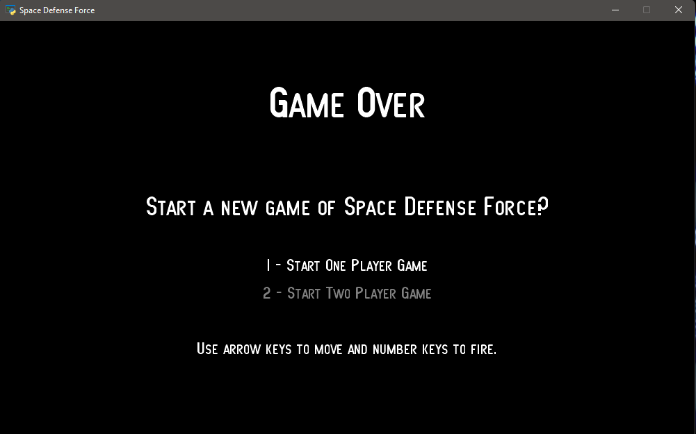

Space Defense Force
===================

An asteroids clone made with the `Arcade library <https://api.arcade.academy>`_.

This example is designed to show off using shaders for visual effects.

I remarked the joysticks feature from game_view until further notice. It was having confliction issues with the game_over_view. Hopefully next update it will be fixed.

ToDo: Will adding hit points to ShipSprite, adding Ufo's in a future update and will be adding hit points to them as well. Will be adding levels, with bosses at the end of each level, with an end game boss. Will be also adding power-ups, missiles and other special treats at a later date. Will potentially add various modes of play from novice, easy, expert, hard, master and legendary. Will also be adding a ranking system for multiplayer. Please be patient.

.. list-table:: Project Files
   :widths: 25 75
   :header-rows: 1

   * - File
     - Description
   * - `__main__.py <source/__main__.py>`_
     - Bootstrap method that loads the fonts and starts the game.
   * - `asteroid_sprite.py <source/asteroid_sprite.py>`_
     - Sprite that represents an asteroid.
   * - `bullet.py <source/bullet.py>`_
     - Base class for all bullets/lasers shot by the players.
   * - `constants.py <source/constants.py>`_
     - Holding place for all constants used in the program.
   * - `explosion.glsl <source/explosion.glsl>`_
     - GLSL code used to display explosions.
   * - `explosion.py <source/explosion.py>`_
     - Python code used to position and render the GLSL explosion code.
   * - `game_view.py <source/game_view.py>`_
     - This is the main view that holds the game logic. If you are looking for the 'guts'
       of the game, this is it. If you aren't familiar with using "views" in Arcade, see the
       `View Tutorial <https://api.arcade.academy/en/latest/tutorials/views/index.html>`_.
  * - `game_over_view.py <source/game_over.view.py>`_
     - This is all the code for the game over screen. Similar in nature to the start view 
       screen. Includes the same instructions as start_view.py. 
   * - `glow_ball.glsl <source/glow_ball.glsl>`_
     - GLSL code used to display a glowy-ball bullet.
   * - `glow_ball.py <source/glow_ball.py>`_
     - Python code used to position and render the GLSL bullet code.
   * - `glow_image_sprite.py <source/glow_image_sprite.py>`_
     - Python code used to position and render the GLSL bullet code.
   * - `glow_line.glsl <source/glow_line.glsl>`_
     - GLSL code used to display a glowy-line laser/bullet.
   * - `glow_line.py <source/glow_line.py>`_
     - Python code used to position and render the GLSL bullet code.
   * - `ship_sprite.py <source/ship_sprite.py>`_
     - Space ship sprite to represent the player.
   * - `start_view.py <source/start_view.py>`_
     - The starting screen that shows the instructions and allows the user to
       select number of players.
   * - `window.py <source/window.py>`_
     - A subclass of Window that also tracks the joysticks that are plugged in.
